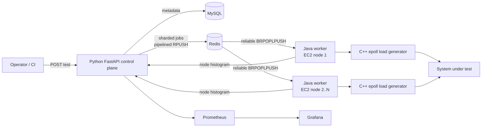

# Distributed Backend & Performance Testing Framework


A production-style framework for coordinating HTTP load tests across multiple
worker nodes. It shards a requested connection count, executes each shard with
a native Linux event loop, stores structured results, and exposes operational
metrics and dashboards.

The repository demonstrates the project described in the resume entry:

- 10,000+ concurrent connections distributed across AWS EC2 workers
- Python control plane, Java worker orchestration, and C++ socket generation
- Redis-backed job delivery with bounded connection pools
- MySQL test history and structured aggregate reports
- Prometheus/Grafana observability
- Jenkins, GitHub Actions, Bash automation, Docker, and Terraform

## Architecture



The control plane divides the exact requested connection count across workers.
For example, 10,000 connections over three shards become 3,334, 3,333, and
3,333. Each worker reserves a job with `BRPOPLPUSH`, launches the native
generator, posts its result, and removes the reserved item only after the API
accepts it. Duplicate node results are safely upserted.

See [docs/architecture.md](docs/architecture.md) for component and failure-mode
details.

## Quick start

Requirements:

- Docker Engine with Docker Compose v2
- Bash (Git Bash or WSL works on Windows)
- At least 4 GB of free memory

Start the full stack with two worker containers:

```bash
cp .env.example .env
docker compose up -d --build --scale worker=2
```

Or use the helper:

```bash
bash scripts/run-local.sh 2
```

Open:

- API and Swagger UI: <http://localhost:8000/docs>
- Grafana: <http://localhost:3000> (`admin` / `admin` by default)
- Prometheus: <http://localhost:9090>

Submit a short local test against the included Nginx target:

```bash
CONNECTIONS=1000 DURATION=20 WORKERS=2 bash scripts/submit-test.sh
```

The response contains a test `id`. Inspect progress and the aggregate report:

```bash
curl http://localhost:8000/api/v1/tests/TEST_ID
curl http://localhost:8000/api/v1/tests/TEST_ID/report
bash scripts/wait-for-report.sh TEST_ID
```

Increase to the résumé-scale run after confirming the host's open-file limit:

```bash
CONNECTIONS=10000 DURATION=60 WORKERS=2 bash scripts/submit-test.sh
```

Only run load tests against systems you own or have explicit permission to
test.

## API

Create a distributed test:

```bash
curl -X POST http://localhost:8000/api/v1/tests \
  -H "Content-Type: application/json" \
  -d '{
    "name": "checkout baseline",
    "target_host": "demo-target",
    "target_port": 80,
    "target_path": "/",
    "concurrent_connections": 10000,
    "duration_seconds": 60,
    "workers": 2
  }'
```

Key endpoints:

| Method | Path | Purpose |
|---|---|---|
| `GET` | `/healthz` | Process liveness |
| `GET` | `/readyz` | MySQL and Redis readiness |
| `POST` | `/api/v1/tests` | Create and shard a test |
| `GET` | `/api/v1/tests` | List recent tests |
| `GET` | `/api/v1/tests/{id}` | Read test status |
| `POST` | `/api/v1/tests/{id}/results` | Receive an idempotent worker result |
| `GET` | `/api/v1/tests/{id}/report` | Merge node metrics and histograms |
| `GET` | `/metrics` | Prometheus metrics |

An aggregate report includes totals, throughput, weighted average latency,
merged p95/p99 latency, error rate, and the merged histogram. A sample is in
[docs/sample-report.json](docs/sample-report.json).

## Redis bottleneck remediation

The optimized path uses:

- one bounded asynchronous Redis pool in the Python service;
- one bounded Jedis pool per Java worker;
- persistent connections with health checks instead of connection-per-job;
- non-transactional pipelining when enqueueing test shards;
- a blocking reservation queue so idle workers do not poll aggressively.

The benchmark method and the recorded 18% response-time improvement are
documented in [docs/performance-analysis.md](docs/performance-analysis.md).
Run `scripts/benchmark-redis.sh` before and after connection-policy changes to
capture comparable Redis measurements under `results/`.

## AWS deployment

Build and publish the worker image:

```bash
docker build -f worker-java/Dockerfile -t REGISTRY/performance-worker:1.0.0 .
docker push REGISTRY/performance-worker:1.0.0
```

Create EC2 worker nodes:

```bash
cd infra/terraform
cp terraform.tfvars.example terraform.tfvars
terraform init
terraform plan
terraform apply
```

The Terraform module spreads worker instances across the supplied subnets,
requires IMDSv2, encrypts root volumes, applies an egress-oriented security
group, installs Docker, and starts the worker image with a 65,536 file
descriptor limit. Use private subnets and internal Redis/API addresses in a
real environment.

## CI/CD

`Jenkinsfile` runs Python unit tests, Java packaging, C++ compilation, Terraform
format validation, Compose validation, image builds, and an API readiness
integration check. It always archives logs and tears the stack down.

`.github/workflows/ci.yml` provides equivalent pull-request validation on
GitHub Actions.

## Development

Run the dependency-free Python domain tests:

```bash
python -m unittest discover -s api/tests -v
```

Build the native generator:

```bash
cmake -S load-generator-cpp -B build -DCMAKE_BUILD_TYPE=Release
cmake --build build --parallel
./build/loadgen --host 127.0.0.1 --port 8080 --connections 1000 --duration 30
```

Build the Java worker:

```bash
mvn -f worker-java/pom.xml verify
```

## Repository layout

```text
api/                    Python control plane and domain tests
database/               MySQL schema
docs/                   Architecture, operations, and performance analysis
infra/terraform/        AWS EC2 worker deployment
load-generator-cpp/     Linux epoll HTTP connection generator
monitoring/             Prometheus and provisioned Grafana dashboard
scripts/                Local run, submission, wait, and benchmark automation
worker-java/             Redis job worker and native-process orchestration
.github/workflows/      GitHub Actions CI
Jenkinsfile             Jenkins declarative pipeline
docker-compose.yml      Complete local environment
```

## Known scope

- The native generator currently supports plain HTTP over IPv4. Put an
  internal reverse proxy in front of HTTPS targets or add TLS support before
  testing them directly.
- The queue provides at-least-once execution. Result writes are idempotent per
  test and node, but an interrupted native process can be retried.
- Grafana shows control-plane health; test-level results are retrieved from the
  report API and MySQL.
- The included credentials are development defaults. Replace them and use a
  secrets manager outside local development.

## License

MIT
